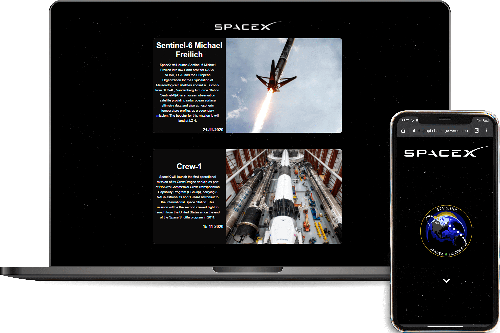

<h1 align="center">
    
</h1>

  <a href="#-site">Site</a>&nbsp;&nbsp;&nbsp;|&nbsp;&nbsp;&nbsp;
  <a href="#-technology">Technology</a>&nbsp;&nbsp;&nbsp;|&nbsp;&nbsp;&nbsp;
  <a href="#-challenge">Challenge</a>&nbsp;&nbsp;&nbsp;|&nbsp;&nbsp;&nbsp;

 

  

                                                                                  
                                                                                  
## 🌌 Site

In the link below you will find the complete responsive website.

-   [SpaceX](http://spacex-graphql-api-challenge.vercel.app/)

## 🚀 Technology

This project was developed with the following technologies:

-   [React](https://reactjs.org)
-   [GraphQL](https://graphql.org/)
-   [Material-UI](https://material-ui.com/)

## 💻 Challenge

This is a quick coding challenge we designed to assess your qualifications as a potential front-end developer. It's important to note that this is by no means a test. We just want to get a sense of how you write code and solve problems.

We'll be looking for **simple and well-designed** code in the submission.

-   Use the [SpaceX Graphql API](https://api.spacex.land/graphql/) and create a project based on this [wireframe](https://bit.ly/2SwvPSP). Use your creativity to choose colors etc...
-   List the last 10 missions
-   Clicking on the card, goes to the **Mission** route
-   Details of the mission (image, etc...)
-   Button to external link
